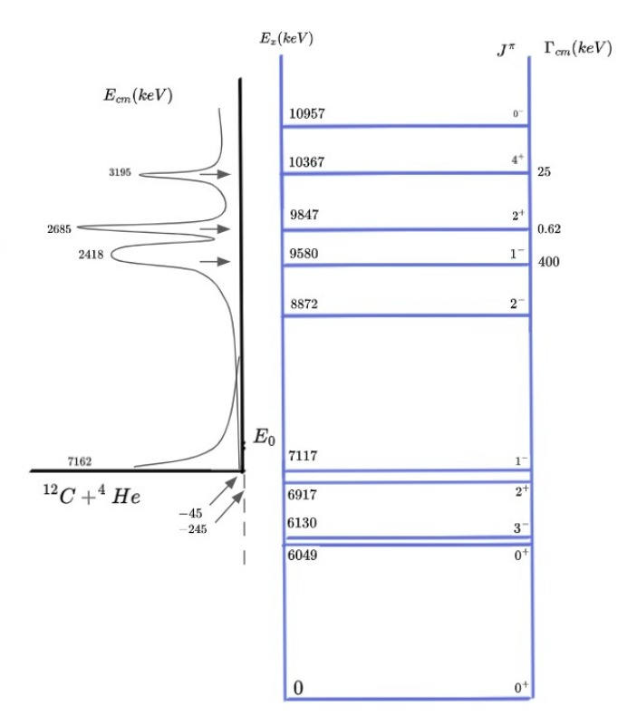

# Investigation of the Resonant Behavior of the S-factor in the $^{12}C(\alpha,\gamma)^{16}O$ within the **Coupled-Channel formalism**

### Abstract 

For this project we are studying the $^{12}C(\alpha,\gamma)^{16}O$ reaction within the context of **Coupled Channel (CC) formalism**. This reaction is one of the most important reactions within the astrophysical scenarios, and due to its very low cross section and the existence of resonances in energies around the Gamow Peak, it represents an important gap in the understanding the star evolution. This reaction is one of the two main processes for Helium burning phase in massive stars and hence it plays a crucial role in the determination of the $^{12}C/^{16}O$ ratio. In 2014 our research group published some results relevant to this reaction, where CC calculations were performed considering only the first excited of $^{12}C (2^+_ 1, 4.44 MeV)$. A detailed analysis of the phase-shifts behavior related to elastic scattering process was made for diferent J values. The main idea of this project is to perform a same analysis, increasing the number of states coupled in a step-by-step process. With this analysis we will be able to describe the resonant behavior of the astrophysical S-factor. Hence, our goal is to investigate the effects of including inelastic channels in the description of the phase-shifts and the resonant behavior of fusion cross sections.

### Introduction 

During the helium-burning phase in stars, when the core temperature exceeds $10^8$ K, two key thermonuclear reactions consume helium: the triple-alpha process $(3\alpha → ^{12}C)$ and the $^{12}C(\alpha,\gamma)^{16}O$ reaction. These reactions are crucial in determining the final carbon-to-oxygen ratio $(^{12}C/^{16}O)$, which significantly affects stellar evolution and nucleosynthesis in massive stars.

Unlike the triple-alpha process, whose reaction rate is relatively well known, the $^{12}C(\alpha,\gamma)^{16}O$ reaction remains uncertain, especially at low energies around the Gamow peak (~300 keV). At these energies, the cross sections are extremely small (~10^{-8} barn), making direct measurement challenging. Additionally, subthreshold states in $^{16}O$ at 6.92 MeV (2⁺) and 7.12 MeV (1⁻) play a significant role in shaping the low-energy behavior, complicating theoretical extrapolations.

