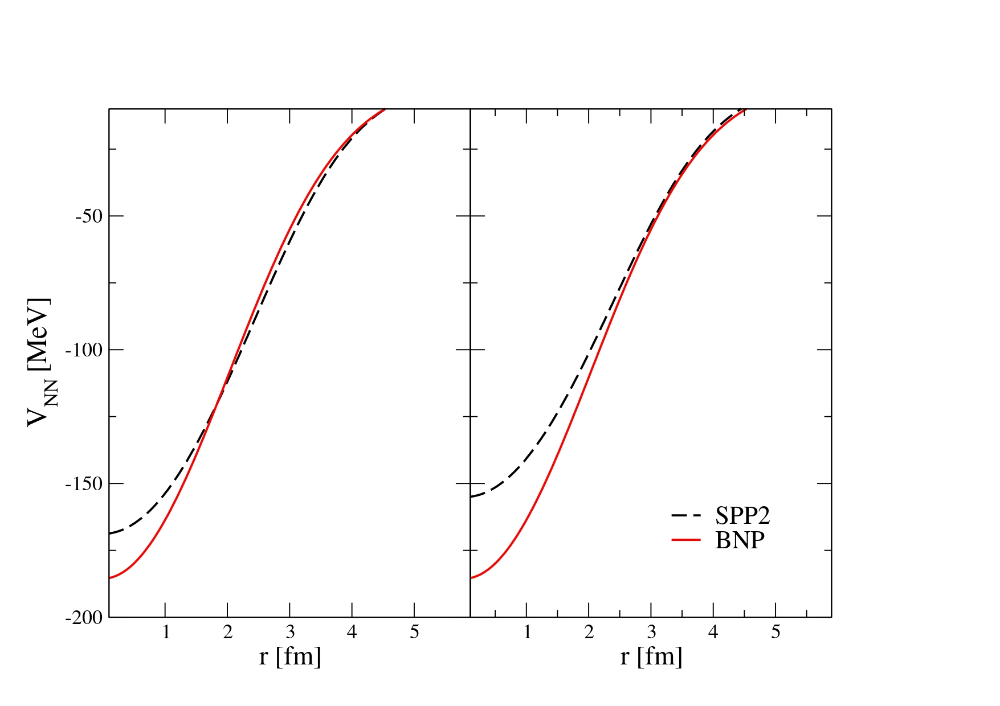
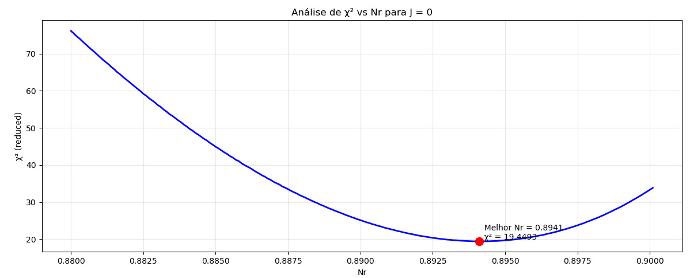
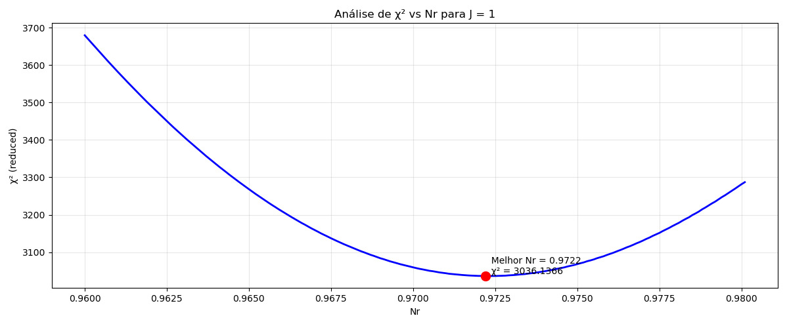
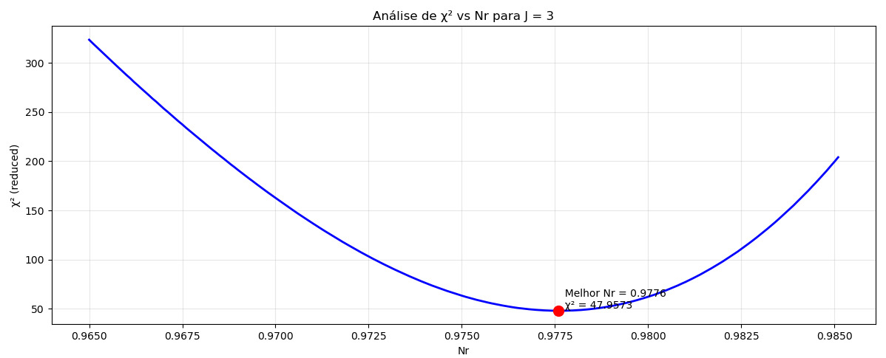

# Investigation of the Resonant Behavior of the S-factor in the $^{12}C(\alpha,\gamma)^{16}O$ within the **Coupled-Channel formalism**

### Abstract 

For this project we are studying the $^{12}C(\alpha,\gamma)^{16}O$ reaction within the context of **Coupled Channel (CC) formalism**. This reaction is one of the most important reactions within the astrophysical scenarios, and due to its very low cross section and the existence of resonances in energies around the Gamow Peak, it represents an important gap in the understanding the star evolution. This reaction is one of the two main processes for Helium burning phase in massive stars and hence it plays a crucial role in the determination of the $^{12}C/^{16}O$ ratio. In 2014 our research group published some results relevant to this reaction, where CC calculations were performed considering only the first excited of $^{12}C (2^+_ 1, 4.44 MeV)$. A detailed analysis of the phase-shifts behavior related to elastic scattering process was made for diferent J values. The main idea of this project is to perform a same analysis, increasing the number of states coupled in a step-by-step process. With this analysis we will be able to describe the resonant behavior of the astrophysical S-factor. Hence, our goal is to investigate the effects of including inelastic channels in the description of the phase-shifts and the resonant behavior of fusion cross sections.

### Introduction 

During the helium-burning phase in stars, when the core temperature exceeds $10^8$ K, two key thermonuclear reactions consume helium: the triple-alpha process $(3\alpha → ^{12}C)$ and the $^{12}C(\alpha,\gamma)^{16}O$ reaction. These reactions are crucial in determining the final carbon-to-oxygen ratio $(^{12}C/^{16}O)$, which significantly affects stellar evolution and nucleosynthesis in massive stars.

Unlike the triple-alpha process, whose reaction rate is relatively well known, the $^{12}C(\alpha,\gamma)^{16}O$ reaction remains uncertain, especially at low energies around the Gamow peak (~300 keV). At these energies, the cross sections are extremely small (~10^{-8} barn), making direct measurement challenging. Additionally, subthreshold states in $^{16}O$ at 6.92 MeV (2⁺) and 7.12 MeV (1⁻) play a significant role in shaping the low-energy behavior, complicating theoretical extrapolations.

In this project, we employ the coupled-channels formalism with a nuclear interaction potential to describe the α + ¹²C system and calculate the fusion cross sections. While various theoretical approaches exist, we will focus on discussing different types of nuclear potentials, particularly those based on mean-field descriptions, that are used to model the interaction.

All the nuclear potentials considered in this work are double-folding potentials, meaning they are obtained through a double convolution between the matter densities of the projectile and the target nucleus with an effective nucleon-nucleon interaction. In general, such potentials can be written as:

$$
V_N(\mathbf{R}) = \int \rho_{m1}(\mathbf{r_1})\rho_{m2}(\mathbf{r_2})\nu_{mm}(\mathbf{R-r_1+r_2})dr_1dr_2
$$

The main differences between the various potentials lie in the density distributions used and the choice of effective nucleon-nucleon interaction.

The first potential we consider is the São Paulo Potential (SPP). It was developed based on a systematic study of heavy nuclei near the valley of stability. In this approach, the nuclear density is described using a two-parameter Fermi function:

$$
\rho(R) = \frac{\rho_0}{1-e^{\frac{R-R_0}{a}}}
$$

From this systematic, average values for the nuclear radius and diffuseness were obtained, allowing the potential to be calculated in a predictive way with no free parameters. However, since the densities are purely systematic, nuclear structure effects—such as deformation or halo features—are not explicitly included.

To overcome this limitation, a second version of the potential, known as SPP2, was developed. This modified version incorporates structure-dependent effects into the density profiles, enabling its application to deformed, light, and exotic nuclei.

It is also important to note that both SPP and SPP2 are energy-dependent potentials, as the energy dependence is embedded in their formulation. In contrast, a third potential used in this study—the BNP potential—is energy-independent, meaning that any energy dependence in the calculated observables arises solely from the channel couplings in the coupled-channels formalism.

For this reason, the BNP potential was chosen as the baseline for this project. The effective interactions used in the folding procedure for each potential are shown below:

$$
\nu_{mm}^{SPP} = V_0\delta(\mathbf{R-r_1+r_2})e^{-4v^2/c^2}\, \hspace{1cm} V_0 = 456 MeV fm^3
$$

$$
\nu_{mm}^{SPP2} = -U_0e^{(-r/a)^2}e^{-4v^2/c^2}\, \hspace{1cm} U_0 = 735.813 MeV \hspace{0.5cm} a = 0.50 fm
$$
$$
\nu_{mm}^{BNP} = -U_0e^{(-r/a)^2}\, \hspace{1cm} U_0 = 87.226 MeV \hspace{0.5cm} a = 0.95 fm
$$

Despite the difference in how energy dependence is treated in SPP2 and BNP, at low energies—relevant for astrophysical scenarios—they are expected to yield similar results. To verify this, we present a comparison between the two potentials in the low-energy regime.

  

The left panel shows the calculated nuclear potentials at an energy of astrophysical interest ($\approx$300 keV). In contrast, the right panel displays the potentials computed at 50 MeV, highlighting a more pronounced difference in potential depth as expected. 

This opens up a valuable perspective for future work: repeating the same analysis with the SPP2 potential and comparing the results with those obtained using BNP, in order to confirm the expected equivalence at astrophysical energies.

### Methodology

As previously mentioned, we will adopt the Brazilian Nuclear Potential (BNP) to describe the nuclear interaction. Since we are dealing with an optical potential—which includes both a real part, representing the nuclear interaction between the colliding nuclei, and an imaginary part, accounting for the absorption of flux from the elastic scattering channel—we assume that the optical potential can be written as follows:

$$
U_{op} = N_R V_N^{BNP} + N_i V_N^{BNP}
$$

Hence, we assume that the imaginary part of the potential is proportional to its real part. It is important to note that two free parameters are introduced in this approach: $N_R$ and $N_i$. The parameter $N_R$ scales the strength of the real (nuclear) part of the potential, while $N_i$ governs the strength of the imaginary part, which accounts for the absorption of flux from the elastic channel.

The first stage of our analysis consists in investigating the phase shifts for the $^{12}\text{C}+\alpha$ reaction (considering only the first excited state of $^{12}C$), as they are directly related to the resonant behavior observed in the astrophysical S-factor. This connection can be understood through the following expression:

$$
\delta_J \approx arctan(\frac{\Gamma/2}{E_R-E})
$$

Hence, for each partial wave—of which only the first few contribute significantly at astrophysical energies—when the system's energy approaches that of a resonance, the corresponding term in the cross section tends to diverge. This behavior manifests as a sharp increase (a "bump") of approximately $\pi$ in the phase shift. Physically, such resonant behavior reflects the formation of a quasi-bound state in the compound nucleus $^{16}$O, which can be interpreted as a configuration of an $\alpha$ particle interacting with a $^{12}$C core.

Following this first stage, we developed a Python program to fit the phase shifts for each value of the total angular momentum $J$ by varying the normalization factor $N_R$. As pointed out in the reference work, this procedure introduces a $J$-dependent character into the nuclear potential. The best-fit phase shifts obtained for each partial wave are presented below. Additionally, we include the corresponding $\chi^2$ curves as a function of $N_R$ for $J = 0$, $1$, and $3$, to illustrate how the fitting procedure was performed and to provide insight into the sensitivity of the fit to the choice of $N_R$.

  
  

  

